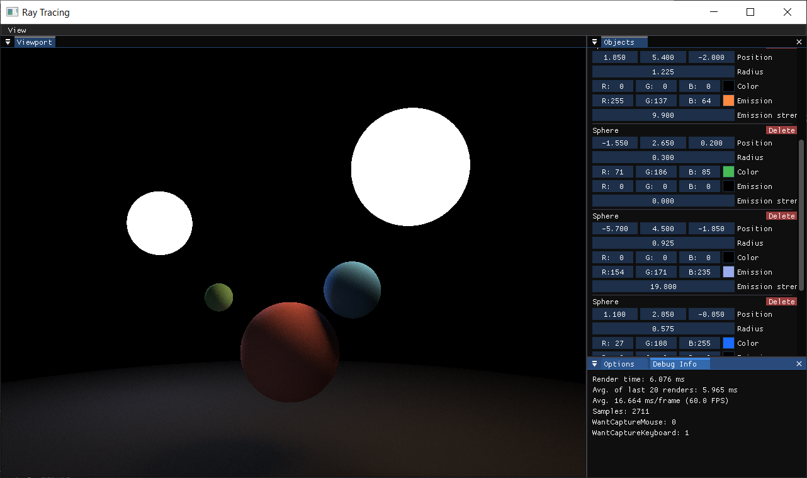

# raytracer

An interactive toy CPU/GPU ray tracer, built using C++, CUDA, OpenGL, and Dear ImGui.



Features:

- Interactive viewport
	- While holding the right mouse button, move the mouse to look around and use W/A/S/D/Q/E to move.
- Sphere primitives
- Diffuse and emissive materials
- CPU or GPU rendering

Future plans:

- Metallic and specular materials
- Antialiasing
- Depth of field
- Model/mesh importing
- BVH acceleration structures
- Texture support

## Building

The [CUDA Toolkit](https://developer.nvidia.com/cuda-toolkit) needs to be installed (tested with version 12.5).
Also requires CMake >=3.24, a C++20 compiler, and a device that supports CUDA and OpenGL 4.6.

In the project root directory:

```sh
mkdir build && cd build
cmake ..
cmake --build .
```

## Useful Resources

Some resources I referenced while building this app:

- [The Cherno's Ray Tracing series](https://www.youtube.com/playlist?list=PLlrATfBNZ98edc5GshdBtREv5asFW3yXl)
- [Ray Tracing in One Weekend: The Book Series](https://raytracing.github.io/)
- [Accelerated Ray Tracing in One Weekend in CUDA](https://developer.nvidia.com/blog/accelerated-ray-tracing-cuda/)
- [Coding Adventure: Ray Tracing](https://www.youtube.com/watch?v=Qz0KTGYJtUk)